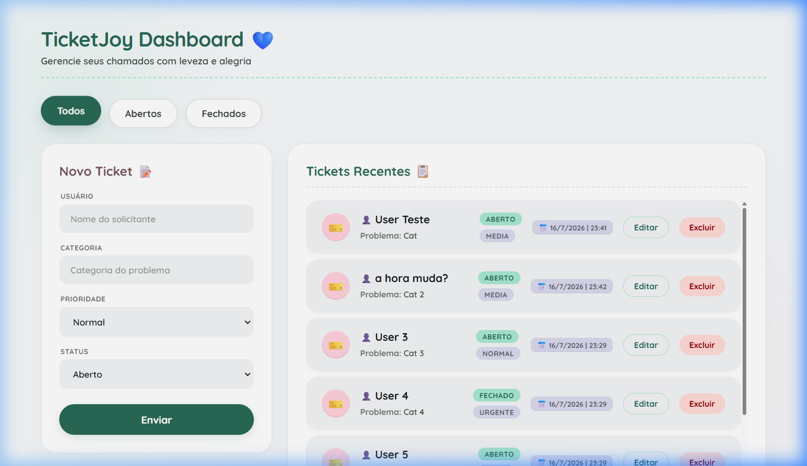

# TicketJoy



**TicketJoy** é um sistema de gerenciamento de chamados de suporte técnico moderno, limpo e intuitivo. Baseado em conceitos de *Minimalismo Suave*, o TicketJoy organiza a rotina de helpdesk em uma interface visualmente limpa, organizada e agradável.

---

## ✨ Funcionalidades Principais

*   **Filtros Rápidos:** Alternância de exibição instantânea entre todos os chamados, apenas abertos ou apenas fechados.
*   **Painel de Cadastro Interativo:** Formulário completo para adicionar novos tickets (definindo Usuário, Categoria/Problema, Prioridade e Status) ou atualizar chamados existentes.
*   **Caixa de Chamados Inteligente (Box List):** Lista de tickets com limite de altura máxima e barra de rolagem integrada. O título permanece fixo no topo (sticky) enquanto as linhas de chamados deslizam por baixo.
*   **Design de Cards Adaptável:** As linhas dos tickets se ajustam automaticamente para acomodar textos muito longos, expandindo o card verticalmente sem quebrar o alinhamento.
*   **Painel Estatístico Dinâmico:** Atualização em tempo real das estatísticas de chamados (total, abertos e fechados) localizadas no rodapé.
*   **Responsividade Completa:** Layout otimizado para Desktop (Bento Grid lateral), tablets e smartphones.

---

## 🎨 Sistema de Design

O estilo visual baseia-se nos seguintes pilares detalhados no guia de estilo:
*   **Cores Suaves:** Paleta com verde menta para ações primárias, rosa suave para marcações secundárias e lavanda para datas.
*   **Suavidade nas Formas:** Cantos arredondados generosos (`1.5rem` / `24px` para os cards e totalmente arredondados para botões e inputs).
*   **Feedback Visual Interativo:** Transição suave no clique dos botões e transição de elevação leve com sombras bem projetadas no hover.
*   **Tipografia:** Uso exclusivo da fonte **Quicksand** do Google Fonts, caracterizada por geometria aberta e terminais arredondados.

---

## 📁 Estrutura do Projeto

O código foi construído com foco na legibilidade e modularidade, separando as responsabilidades:

```text
├── index.html                    # Estrutura semântica principal do aplicativo
├── assets/
│   ├── images/
│   │   └── favicon.png           # Ícone oficial da página
│   ├── scripts/
│   │   ├── script.js             # Lógica e controle de estado dos chamados (ES Modules)
│   │   └── json/
│   │       └── tickets.json      # Carga inicial estática de dados dos chamados (JSON)
│   └── styles/
│       ├── style.css             # Ponto de entrada unificado das importações CSS
│       ├── variables.css         # Variáveis nativas do CSS (:root) e fonte Quicksand
│       ├── base.css              # Reset geral, grade principal do body e animações
│       ├── buttons.css           # Botões de filtragem e envio
│       ├── form.css              # Painel do formulário "Novo Ticket"
│       ├── ticket-list.css       # Grade da lista, cabeçalho sticky e rows dos tickets
│       ├── status.css            # Painel do sumário estatístico do rodapé
│       └── responsive.css        # Media queries para telas mobile e tablets
```

---

## 🛠️ Tecnologias Utilizadas

*   **HTML5** semântico.
*   **Javascript Vanilla** (ES Modules, manipulação de DOM e LocalStorage).
*   **CSS3 Modular** (Flexbox, CSS Grid, variáveis nativas e importações `@import`).
*   **Google Fonts** (Quicksand).

---

## 🚀 Como Executar o Projeto

Como o projeto é construído apenas com tecnologias nativas da web, não é necessária nenhuma etapa de build ou instalação de dependências complexas.

1. Baixe ou clone este repositório.
2. Abra o arquivo `index.html` diretamente em seu navegador de preferência ou execute-o através de uma extensão de servidor local no VS Code (como a **Live Server**).